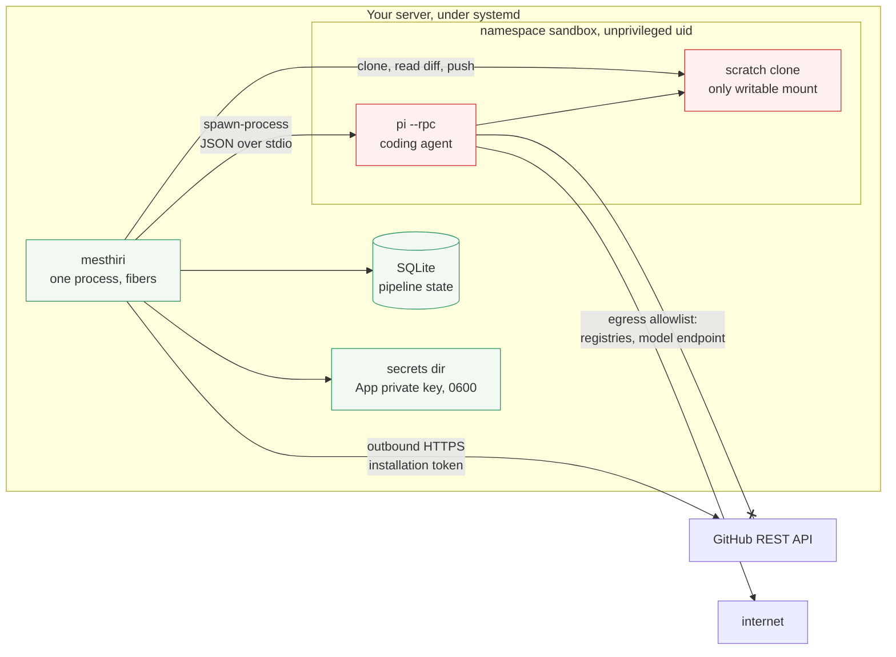
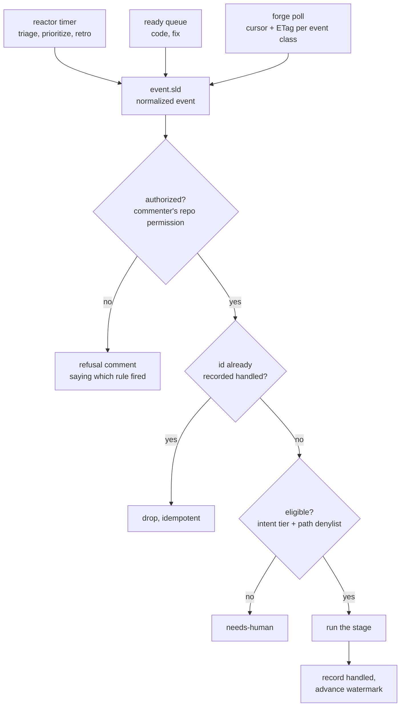
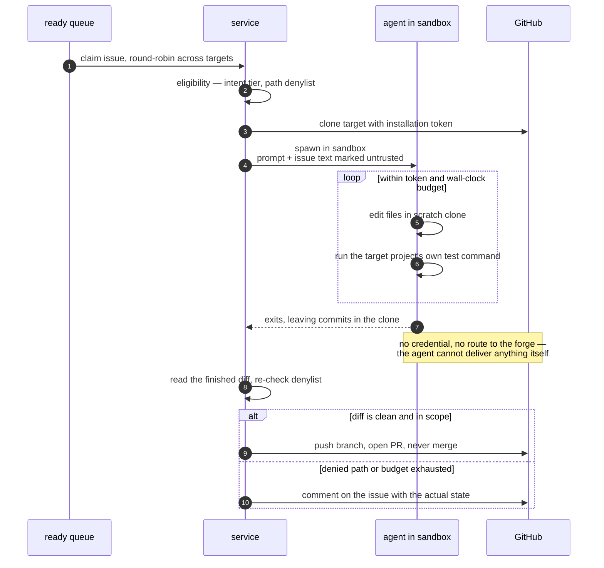
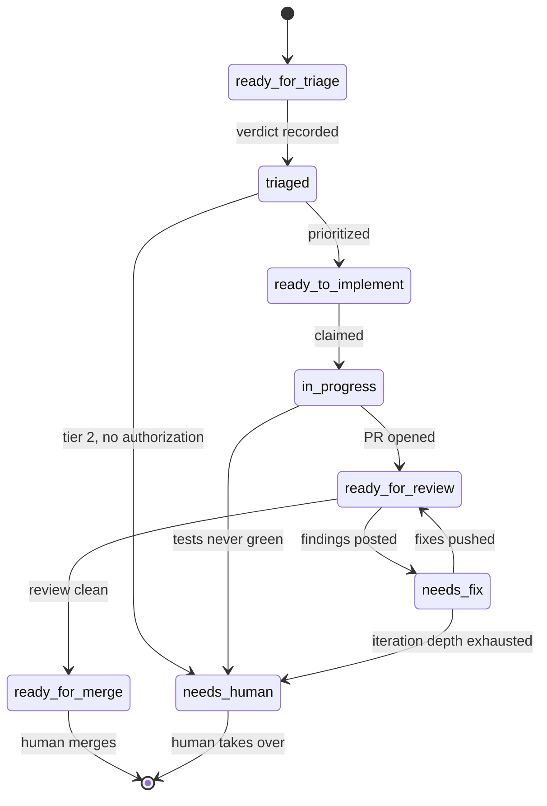
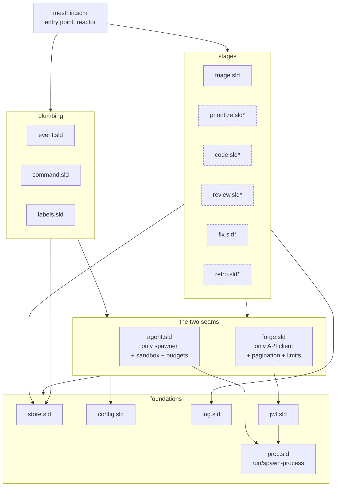
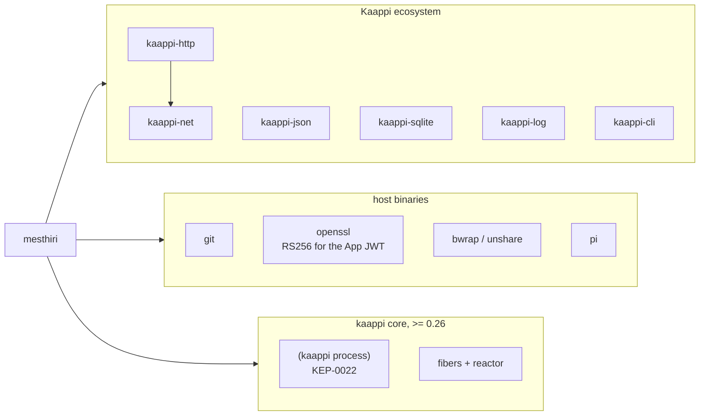

# mesthiri — architecture

Status: derived document, 2026-09-04. [design.md](design.md) is the design
authority and [plan.md](plan.md) sequences the work; this file only draws
what those two describe. If a diagram here disagrees with design.md,
design.md is right and the diagram is stale — fix it.

Diagrams are Mermaid, so they render on GitHub without a build step.

## 1. Deployment and trust zones

One process on one server. Everything mesthiri touches is either inside the
process, inside the agent's sandbox, or reached over outbound HTTPS —
nothing listens on an inbound port.

The crossed edge is the load-bearing one: **the agent has no credential and
no route to the forge.** The secrets directory is outside its mount
namespace — unreachable rather than merely unreadable — and the forge is
deliberately absent from its egress allowlist.

| Zone | Trust | Holds |
|---|---|---|
| Service | trusted | credentials, store, all forge calls, all policy decisions |
| Sandbox | untrusted | the agent and the scratch clone it may write |
| Forge | untrusted input | issue and PR text, authored by anyone |

## 2. How a stage gets woken

Three sources, one shape. Routing and authorization happen once, in one
place, regardless of which source fired.

Polling is the only delivery mechanism; there is no webhook receiver and no
driver indirection standing in for one. The watermark advances only *after*
work is recorded handled, so a crash mid-stage replays rather than loses.

## 3. The lifecycle

```mermaid
flowchart LR
  issue(["new issue"]) --> tri
  tri["Triage<br/>verify claims<br/>priority + intent tier"] --> pri
  pri["Prioritize<br/>rank into ready queue"] --> code
  code["Code<br/>agent implements<br/>service pushes"] --> pr(["pull request"])
  pr --> rev
  rev["Review<br/>correctness, security,<br/>performance, intent"]
  rev -->|"findings"| fix["Fix<br/>bounded iterations"]
  fix --> rev
  rev -->|"clean"| gate{{"HUMAN<br/>reviews and merges"}}
  fix -->|"depth exhausted"| gate
  gate --> merged(["merged"])
  merged --> retro["Retro<br/>mine run records"]
  retro -->|"proposals as issues<br/>on mesthiri"| human2{{"HUMAN<br/>implements them"}}

  style gate fill:#ffe9b3,stroke:#b8860b,stroke-width:2px
  style human2 fill:#ffe9b3,stroke:#b8860b,stroke-width:2px
```

The two shaded boxes are the only places a human is mandatory, and both are
structural rather than procedural: the App holds no merge permission, and
mesthiri is never configured as a target of its own pipeline, so it cannot
implement the retro proposals it files.

## 4. The code stage, at the credential boundary

The sharpest thing in the design, and the hardest to see in prose. The
agent's job ends at "commits exist in a directory".

Step 3 and the final step are the only moments a credential is used, and
both happen outside the sandbox. The eligibility check sits *on* the path a
change takes to GitHub rather than beside it — there is no second path.

## 5. Workflow labels

Workflow state lives on the target repo where a human can read it and change
it, not only in mesthiri's database. Transitions are guarded, states are
mutually exclusive, and every write is read back to confirm it took.

The rule that earns the machine its keep is not drawn as a transition
because it applies from almost everywhere: **a new commit clears every
downstream label**, so a `ready_for_merge` earned by one head cannot survive
the push that invalidated it.

## 6. Module map

Control flows downward. `agent.sld` is the only module that spawns the
coding agent; `forge.sld` is the only module that talks to the GitHub API.
A second agent backend or a second forge is a new module at those two
seams, not a change to any stage.

`*` — dashed modules are the stage bodies for milestones M5 onward; their
names are indicative, since [plan.md](plan.md) has not fixed them yet.
Everything else is named in the plan.

## 7. External dependencies

Deliberately absent: `kaappi-crypto` (RS256 is one `openssl` call, and
depending on a feature that does not exist yet put another repo's release on
this one's critical path), `gh` (`forge.sld` is the only API path), and any
inbound HTTP server.
