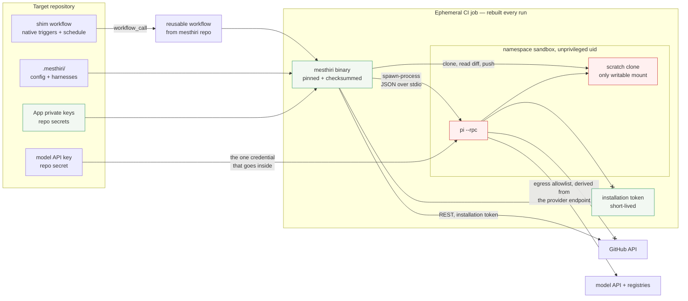
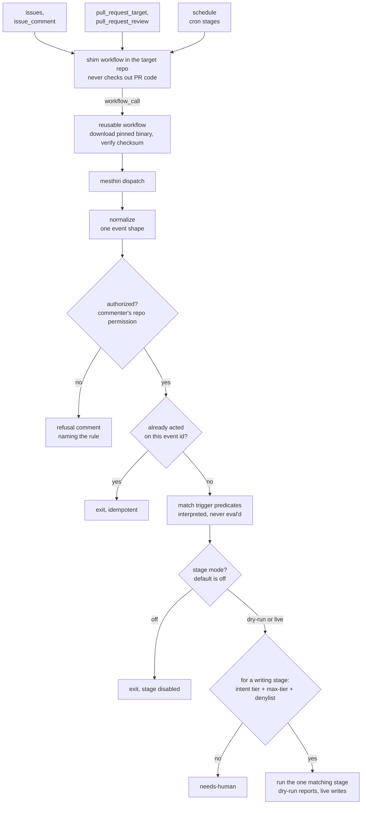
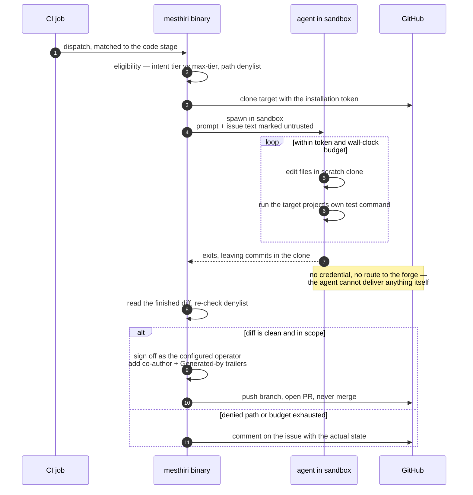
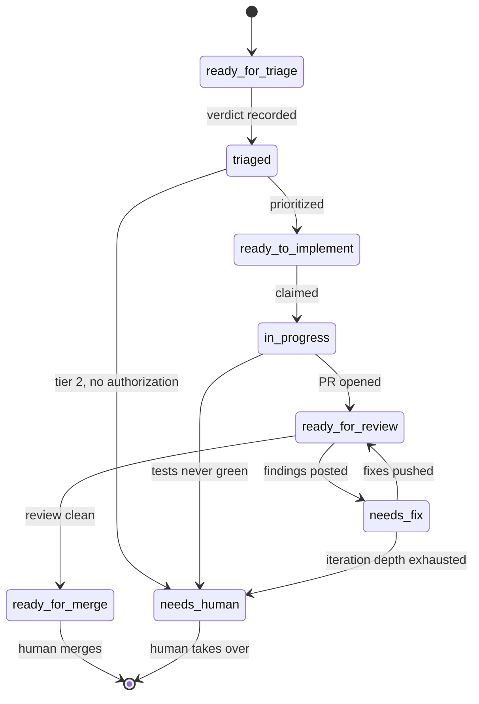
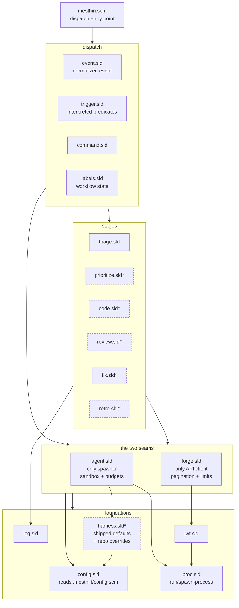
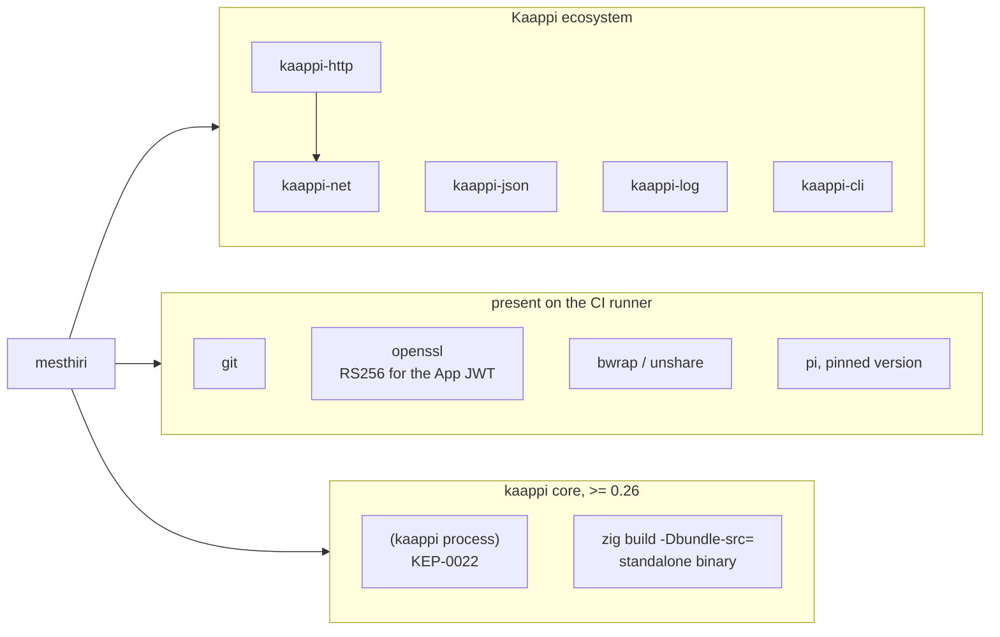

# mesthiri — architecture

Status: derived document, 2026-09-04, redrawn for the CI-native execution
model. [design.md](design.md) is the design authority and [plan.md](plan.md)
sequences the work; this file only draws what those two describe. If a
diagram here disagrees with design.md, design.md is right and the diagram is
stale — fix it.

Diagrams are Mermaid, so they render on GitHub without a build step.

## 1. Where things run, and what trusts what

There is no server. A workflow in the target repository runs one binary in
an ephemeral CI job, and the agent is sandboxed *within* that job.

The two crossed edges are the load-bearing ones: **the agent holds no
*repository* credential and has no route to the forge.** The App keys and
the installation token sit outside its mount namespace, and the forge is
deliberately absent from its egress allowlist.

One credential does go in, and the diagram says so rather than implying a
cleaner boundary than exists: the agent cannot call a model without the
model API key, so that key — and only that key — is inside. It buys tokens
from a model provider and grants nothing on the repository, so an agent that
leaks it costs money rather than code.

| Zone | Trust | Holds |
|---|---|---|
| Repository | maintainer-controlled | the shim, `.mesthiri/` policy, App keys as secrets |
| CI job | trusted for the run | the binary, the App keys, the installation token, every forge call |
| Sandbox | untrusted | the agent, the clone it may write, and the model API key |
| Issue and PR text | hostile input | authored by anyone who can comment |

## 2. The dispatch path

One event, one stage, one job. Authorization and trigger matching happen
once, inside the binary, whatever fired it.

Every stage defaults to `off`, so "the stage is disabled" is the most
likely answer to *why did nothing happen* on a fresh install — which is why
`mesthiri explain-event` prints the mode alongside the predicates it tested,
rather than only the predicates.

`pull_request_target` is not a detail. A `pull_request`-triggered workflow
runs the copy of itself from the PR's own branch, so anyone opening a pull
request could rewrite it and read the secrets it holds; `pull_request_target`
runs the base branch's copy instead. The shim also never checks out the PR's
code, and a test asserts that.

## 3. The lifecycle

```mermaid
flowchart LR
  issue(["new issue"]) --> tri
  tri["Triage<br/>verify claims<br/>priority + intent tier"] --> pri
  pri["Prioritize<br/>rank into ready queue"] --> code
  code["Code<br/>agent implements<br/>the job pushes"] --> pr(["pull request"])
  pr --> rev
  rev["Review<br/>correctness, security,<br/>performance, intent"]
  rev -->|"findings"| fix["Fix<br/>bounded iterations"]
  fix --> rev
  rev -->|"clean"| gate{{"HUMAN<br/>reviews and merges"}}
  fix -->|"depth exhausted"| gate
  gate --> merged(["merged"])
  merged --> retro["Retro<br/>mine run records"]
  retro -->|"proposals as issues<br/>on this repo"| human2{{"HUMAN<br/>reads and acts"}}

  style gate fill:#ffe9b3,stroke:#b8860b,stroke-width:2px
  style human2 fill:#ffe9b3,stroke:#b8860b,stroke-width:2px
```

The two shaded boxes are the only places a human is mandatory. The merge
gate is structural — no App holds merge permission. The retro gate is not:
retro files its proposals on the repository mesthiri is installed in, so
those issues can re-enter the pipeline like any others, and a human reading
them is a matter of them being ordinary issues rather than a mechanism
stopping anything. What *is* structural is that mesthiri is never installed
on its own repository, so it cannot act on proposals about itself.

## 4. The code stage, at the credential boundary

The sharpest thing in the design, and the hardest to see in prose. The
agent's job ends at "commits exist in a directory".

Step 3 and the final step are the only moments a credential is used, and
both happen outside the sandbox. The eligibility check sits *on* the path a
change takes to GitHub rather than beside it — there is no second path.

## 5. Workflow labels

Workflow state lives on the repository where a human can read it and change
it. There is no database it could live in instead — these labels are the
state. Transitions are guarded, states are mutually exclusive, and every
write is read back to confirm it took.

The state names are drawn with underscores because Mermaid's state diagrams
want them that way; the labels themselves are hyphenated —
`ready-for-triage`, not `ready_for_triage`. [terminology.md](terminology.md)
has the canonical spelling.

The rule that earns the machine its keep is not drawn as a transition
because it applies from almost everywhere: **a new commit clears every
downstream label**, so a `ready_for_merge` earned by one head cannot survive
the push that invalidated it.

## 6. Module map

`agent.sld` is the only module that spawns the coding agent and the only one
that builds the sandbox; `forge.sld` is the only module that talks to the
API. A second agent backend or a second forge is a new module at those two
seams, not a change to any stage.

`*` — dashed modules are named indicatively: the stage bodies for M5 onward,
and the harness resolver that layers a repo's `.mesthiri/harness/<role>.scm`
over mesthiri's shipped default. [plan.md](plan.md) has not fixed those
names yet. There is no
store module, and no cursor file: state lives in labels and in the forge,
and scheduled sweeps find their work by querying it.

## 7. External dependencies

Deliberately absent: `kaappi-sqlite` (the repository is the coordinator, so
there is no database), `kaappi-crypto` (RS256 is one `openssl` call, and
depending on a feature that does not exist yet would put another repo's
release on this one's critical path), `gh` (`forge.sld` is the only API
path), and any inbound HTTP server.

A target repository needs none of the Kaappi ecosystem installed. The
workflow downloads one standalone binary and verifies its checksum.
